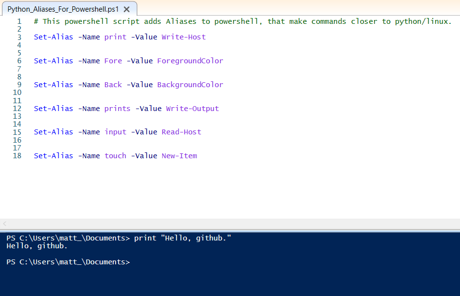

# Python_Aliases_For_Powershell (.ps1)
After running this powershell script you will have python/bash aliases for powershell. Print in powershell, will mean the same as print in python.

## The Script
When you run the .ps1 file it will add in all the ALIASES for you. In this script you will find all the following commands. 

## Creat a print function
   `Set-Alias -Name print -Value Write-Host`  

## Creat a simpler colored text function
   `Set-Alias -Name Fore -Value ForegroundColor`
  
## Creat a simpler colored background function
   `Set-Alias -Name Back -Value BackgroundColor`
  
## Creat a pipe-able print function
   `Set-Alias -Name prints -Value Write-Output`
  
## Creat a input function
   `Set-Alias -Name input -Value Read-Host`
  
## Creat a Linux touch function 
  
  `Set-Alias -Name touch -Value New-Item`

## Path
When you run the `PythonPathMaker.ps1` file, it will calls in the aliases to import when you type `$profile`. Read script's comments for extra instructions. 

## More to come
As I learn about more cmdlet's for aliases I will add more to this script.
